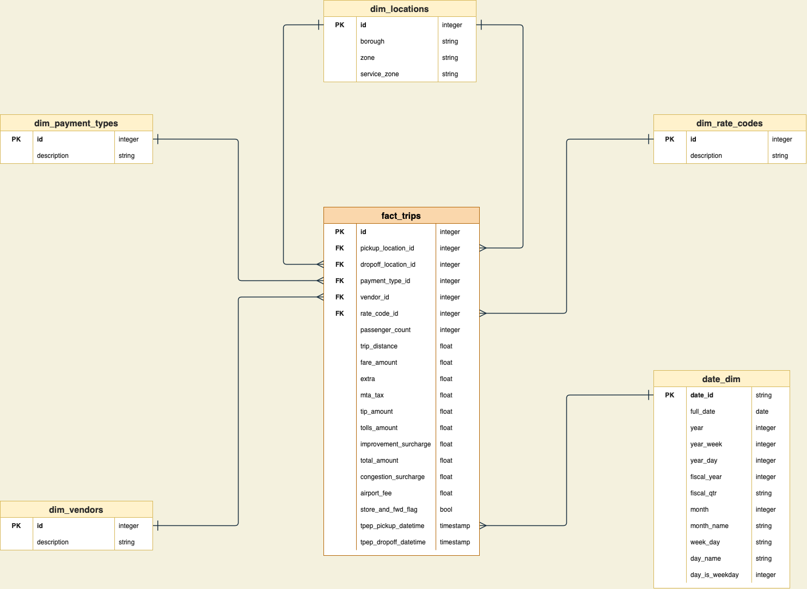

# NYC TLC - Yellow Taxi data modelling

A project to store all the notes and codes for Yellow Taxi data modelling.

Data source: https://www.nyc.gov/site/tlc/about/tlc-trip-record-data.page. Dataset from December 2019 was used. Data Dictionaries and MetaData can be found by following the same link.

# Using virtual environment

Create virtual environment
```
python3 -m venv dbt-env-taxi
```

Activate virtual environment
```
source dbt-env-taxi/bin/activate
```

Upgrade pip
```
pip install --upgrade pip wheel setuptools
```

Install packages from the **requirements.txt** to the virtual environment
```
pip install -r requirements.txt
```

# Summary
Raw data is available in single Parquet files for each year-month combination. Thus it was decided to upload it directly from the [TLC Trip Record Data](https://www.nyc.gov/site/tlc/about/tlc-trip-record-data.page) and load it to BigQuery.
Raw data has been uploaded to Google BigQuery by running `raw_data_transfer_to_bq.py` and `load_countries_to_bq.py` on a local machine.
No transformations performed in this step, automatic schema detection was used, data located in EU.
It could have been run on google cloud shell editor too or included in workflow orchestration tool like apache airflow.

After exploring raw data it was decided to split data warehouse layer into single fact table containing all quantitative information about NYC yellow taxi trips and 5 dimensional tables containing descriptive information that can be used to filter, group, or aggregate the data.
The foreign keys in the fact table were created to be able to connect it to the dimension tables.

Physical data warehouse ERD:



By analyzing raw data ([colab notebook](https://colab.research.google.com/drive/160seNk-KI0pRVFV9ljDvpjlqM4jl1SlG?usp=sharing))
multiple data and data dictionary missmaches has been observed:
- Around 1.5k observations with date out of 2019-12 range
- Some anomalous values in variables coding observed
- Date out of scope comes only from VendorID == 2
- 4775 observations when pickup time is same as dropoff time
- 4 observations with pickup time greater than dropoff time
- Missing **airport_fee** values. Probably introduced later
Data dictionary: *Yellow trip data will now include 1 additional column (‘airport_fee’, please see Yellow Trips Dictionary for details). The additional column will be added to the old files as well. The earliest date to include the additional column: January 2011.*
- **payment_type** values range from 0 to 5 instead of from 1 to 6
- Missing data mostly comes from **VendorID == 2** and **payment_type == 0**

For comparison purposes same tests were performed on 2021-12 dataset.
Same comments except **airport_fee** available.

To solve theses issues it would be beneficial to disscuss with bussiness/IT people who are creating or managing it.
However, currenly it was not possible so I did some assumptions and following data filters were applied:
```
    (
        (YEAR(pickup time) = 2019
            AND MONTH(pickup time) = 12)
        OR
        (YEAR(dropoff time) = 2019
            AND MONTH(dropoff time) = 12)
    )
    AND payment_type IN (1,2,3,4,5,6)
    AND VendorID IN (1,2)
    AND ratecodeid IN (1,2,3,4,5,6)
    AND passenger_count NOT IN (0)
```

Finally, analytics layer was created.
Generaly, it duplicates warehouse layer with views and adds **trip_time_seconds** variable.
I was also thinking about OBT, but decided to keep it this way. It would be easier to decide knowing analysts needs.

For data transformations dbt was used. Some general data uniquenes, not null tests performed.
Tests could be improved by testing relations, data sources, allowing only particular values in some fields.
I was not able to create date partitioned tables due to google free account limitations.

For scheduling data pipelines I would think about several options:
1. Cron jobs to perform proccess on given schedule;
2. Cloud-based scheduling/processing tools like Google Dataflow;
3. Using workflow managing tools like Apache Airflow.

When implementing any of the scheduling methods, I would collect data pipilines performance statistics (error rates, resources usage, data volumes) and general info about data processed (missing values, outliers, data types).
